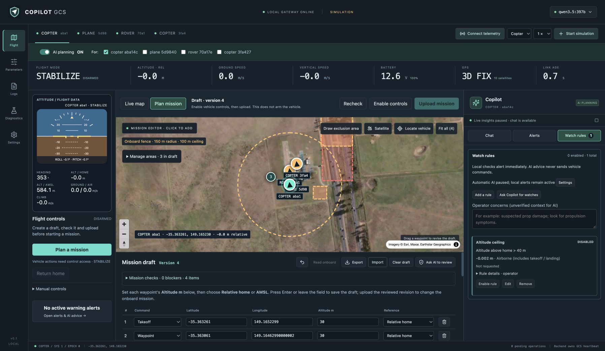

<p align="center"></p>

# Copilot GCS

A web ground control station for ArduPilot **Copter, Plane and Rover**, with an integrated AI chat.



## Features

- **AI planning:** multi-step tool calls read, edit and check missions in one conversation; inspect each action.
- **Flight workspace:** map, instruments and flight controls; separate Chat, Alerts and Watch rules panels.
- **Planning:** waypoint editing, drawn inclusion/exclusion areas and verified fence upload; parameters, logs and replay.
- **Multiple vehicles:** select Copilot's targets and run up to six simulations together.
- **Vision support:** attach the map to propose boundaries; Settings shows image/tool compatibility. [AI interface](docs/ai-interface.md).
- **Your model and usage:** Ollama cloud or a local endpoint; saved prompts, per-vehicle monitoring and a shared automatic request limit.
- **Visible watch rules:** describe extra concerns in chat; visible checks turn red and can prompt AI even with periodic monitoring off. Rehearse failures in Diagnostics.

Vehicle writes currently support **app-owned SITL only**. Uploads, parameter application and flight commands require explicit operator actions.

## Setup

Tested on macOS Apple Silicon. Requires **Python 3.13, Node 22+, Git and a C/C++ compiler**. On macOS, install Xcode Command Line Tools and Homebrew first. [Full setup and troubleshooting](docs/setup.md).

```sh
brew install git python@3.13 node@22 gawk
export PATH="$(brew --prefix node@22)/bin:$PATH"

git clone https://github.com/standon99/copilot-gcs.git
cd copilot-gcs

git clone --branch Copter-4.7.1 --depth 1 \
  https://github.com/ArduPilot/ardupilot.git ardupilot
git -C ardupilot checkout --detach dbe792162d06cab66c3475fd5556bf7a120f119e
git -C ardupilot submodule update --init --recursive

python3.13 -m venv .venv
./scripts/setup.sh
./scripts/build-sitl.sh
git config core.hooksPath .githooks
```

Setup creates an ignored `.env`. Add your cloud key there, or configure a running local model in **Settings**:

```dotenv
OLLAMA_API_KEY=your-key
OLLAMA_BASE_URL=https://ollama.com/v1
OLLAMA_MODEL=gpt-oss:120b
MONITOR_INTERVAL=300
```

Keep the key out of Git. For local Ollama, use `http://localhost:11434/v1` and an installed model ID; no cloud key is sent to local endpoints.

## Run

```sh
./start.sh
```

Open **http://127.0.0.1:8080**. For another port: `COPILOT_PORT=8091 ./start.sh`. Stop with **Ctrl+C**.

1. **Settings:** choose the model, automatic request limit and periodic/watch-advice switches; save.
2. Choose a vehicle and **Start simulation**. Wait for home and telemetry.
3. Send the brief to **Copilot**, or add waypoints in **Plan mission**. Run **Check draft**.
4. **Enable vehicle controls**, upload, then use **Flight controls** to prepare, arm and start. **Diagnostics** contains failure simulations.

## More

[Usage guide](docs/usage.md) · [Screenshots](docs/screenshots/README.md) · [Development](docs/development.md) · [Validation](docs/validation.md) · [Product](docs/product.md)

[MIT licensed](LICENSE). ArduPilot and other dependencies retain their own licenses. [Contribution rules](CLAUDE.md).
