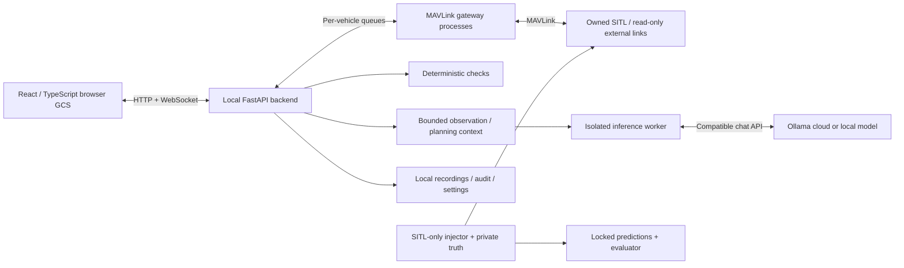

# ArduPilot Safety Copilot

A browser ground station for **ArduPilot Copter, Plane and Rover**, with an LLM copilot for mission planning, telemetry assessment and operator-error review. A built-in SITL laboratory tests whether the model notices faults without being told which fault was injected.

The aim is one workspace where you can **describe a mission, refine it on the map or in chat, inspect and apply configuration changes, operate a vehicle, and understand what its telemetry means**. The current implementation is a local research application with real MAVLink/SITL integration and real Ollama inference.

**Status:** functional multi-vehicle SITL prototype. Vehicle writes are limited to simulators launched by this app; external connections are read-only. LLM advice and draft edits do not constitute validated flight-safety assurance or full Mission Planner feature parity.

[Setup](#setup-from-a-fresh-clone) · [Using the app](#using-the-app) · [Inference settings](#inference-settings-and-usage) · [Failure experiments](#sitl-failure-experiments) · [Roadmap](#what-we-want-to-build-next) · [Design](docs/design.md) · [Validation](docs/validation.md) · [MIT license](LICENSE)

## The actual application

These are screenshots of the running production frontend connected to real native Copter SITL instances, captured on 2026-09-17. The displayed conversation came from a real Ollama request. Automatic assessments were paused during capture; this is a demonstration of the interface, not a benchmark result. [Capture details and refresh instructions](docs/screenshots/README.md).

### Flight, vehicle positions and instruments

The selected copter is holding at 30 m above home in AUTO; the second copter remains disarmed. The map shows vehicle labels and the reported target. The flight instrument displays attitude, heading, altitude, speed and climb.


### Conversational planning and waypoint editing

The map and waypoint table share a versioned draft. The main-page interaction toggle scopes LLM edits to checked vehicles; requested parameter changes appear as reviewable proposals in the copilot panel.


<details>
<summary><strong>Settings: model, endpoint, assessment cadence and persistent prompts</strong></summary>


</details>

<details>
<summary><strong>Diagnostics: select failure modes and run blinded SITL trials</strong></summary>


</details>

## What the project does

| Area | Implemented behavior |
| --- | --- |
| Multi-vehicle operation | Copter, conventional Plane and Rover; up to six concurrent sessions, including multiple copters; separate gateways, ports, state and control leases |
| Flight workspace | Mode/armed state, battery, GPS, freshness, status messages, artificial horizon, heading, relative/AMSL altitude, ground/air speed and climb |
| Maps | Satellite/street basemaps, labelled vehicle positions, heading markers, draft/onboard route overlays, fence circle, target stick and projected navigation-bearing carrot |
| Mission planning | Map clicks/dragging, editable waypoint table, altitude datum, import/export, versioned revisions, undo, checks, explicit reviewed upload and readback |
| LLM interaction | Explicit target selection; typed draft edits; parameter proposals with old/new values, expiry, conflict checks, manual Apply and verified readback |
| Mission intent | Optional brief interpreted into proposed constraints; operator acceptance; altitude, speed, route corridor, exclusion and required-command checks |
| Parameters | Discovery/refresh, firmware-derived descriptions and ranges, search, staged edits, JSON import/export, disarmed writes and readback |
| Onboard geofence | Home-centred circle and optional altitude ceiling, breach action selection, verified parameter writes and map boundary |
| Monitoring | Independent numerical checks plus configurable periodic, evidence-citing LLM assessments; explicit unavailable/stale states |
| Logs and replay | MAVLink recordings, normalized telemetry, audit events, onboard DataFlash listing/download and causal historical replay |
| Failure laboratory | Nominal controls and vehicle-specific fault injection; separate telemetry-only and operational evidence tracks; locked predictions and reported results |
| Settings | Model/endpoint choice, model discovery, connection test, cadence/global pause, timeout, and four editable prompts persisted across restarts |

The [implementation reference](docs/implementation.md) describes exact operating boundaries. The [validation record](docs/validation.md) reports what was actually tested, including missed detections and limitations.

## Why an LLM is useful here

The research question is whether an LLM adds useful context, explanation or detection beyond the autopilot's own warnings and deterministic checks. Useful situations include:

- **Before deployment:** explain inconsistent waypoint altitudes, missing takeoff/recovery steps, incompatible commands, ambiguous mission statements or risky parameter choices.
- **Operator-error review:** compare the requested mission with the edited draft and the uploaded revision; identify a wrong vehicle target, wrong altitude reference or stale plan.
- **During a mission:** explain deviations from approved altitude/speed/corridor constraints and relate changes in navigation, attitude, battery or estimator behavior to supplied evidence.
- **Loss of visibility:** distinguish missing/stale telemetry or unavailable inference from a nominal vehicle state.
- **After a flight:** help inspect recordings, correlate events and explain observations while separating symptoms from uncertain root causes.

Only supported numerical constraints are enforced by the deterministic layer. Battery endurance prediction, terrain clearance, payload correctness and general root-cause diagnosis are research goals, not implemented guarantees. The LLM receives bounded context; it can miss faults, misunderstand a request or describe a different command from the structured edit it produced. Inspect the actual draft and parameter cards before applying them.

## How it works



The browser does not connect directly to MAVLink sockets. The backend owns GCS heartbeats, vehicle sessions and command verification. Each operator command uses a renewable control lease and fresh vehicle state. Model responses pass application validators; the inference worker has no vehicle-control tools or application session cookie.

Map markers and flight instruments use telemetry directly and do not consume model requests. On macOS, inference workers also run inside a filesystem/network sandbox. Other platforms report when that isolation is unavailable. The [design document](docs/design.md), [feasibility analysis](docs/feasibility.md) and [evaluation protocol](docs/sitl-evaluation.md) explain the broader design and its acceptance goals.

## Setup from a fresh clone

### Requirements and platform support

- **Validated host:** macOS on Apple Silicon, Python **3.13**, Node.js **22+**, npm and a current browser with WebGL support.
- **Native tools:** Git and a working C/C++ compiler. On macOS, install Xcode Command Line Tools and Homebrew. The web GCS does not require MAVProxy.
- **SITL:** build the three native binaries from the pinned ArduPilot checkout below. The source checkout and binaries are not included in this Git repository.
- **Inference:** an Ollama cloud account/key, or an already-running local OpenAI-compatible model endpoint. You can use the GCS without inference; chat and automatic assessments require a working provider.
- **Network/storage:** initial dependency/source downloads, build space, and network access to the selected imagery and inference providers. Runtime recordings consume additional disk space.

Linux is a portability path, not a platform validated by this repository's current evidence. Install a Python 3.13 interpreter and Node 22+, follow [ArduPilot's Linux prerequisites](https://ardupilot.org/dev/docs/building-setup-linux.html), then use the common clone/build steps below. Native Windows is not supported by these shell scripts; a WSL2/Linux setup requires separate validation. See also [ArduPilot's macOS setup reference](https://ardupilot.org/dev/docs/building-setup-mac.html).

### 1. Install host tools on macOS

Install Xcode Command Line Tools if they are not already present, and complete the installer:

```sh
xcode-select --install
```

With [Homebrew](https://brew.sh/) installed:

```sh
brew install git python@3.13 node@22 gawk
export PATH="$(brew --prefix node@22)/bin:$PATH"
python3.13 --version
node --version
npm --version
```

Keep Node 22+ on your PATH in subsequent terminals. If you already have suitable tools, use those instead.

### 2. Clone the app and the pinned simulator source

```sh
git clone https://github.com/standon99/copilot-gcs.git
cd copilot-gcs

git clone --branch Copter-4.7.1 --depth 1 \
  https://github.com/ArduPilot/ardupilot.git ardupilot
git -C ardupilot checkout --detach dbe792162d06cab66c3475fd5556bf7a120f119e
git -C ardupilot submodule update --init --recursive
git -C ardupilot rev-parse HEAD
```

The final command must report `dbe792162d06cab66c3475fd5556bf7a120f119e`. This commit supplies all three profiles; the native binaries report 4.7.1. Keep the revision pinned: parameter metadata and failure adapters are tied to it. `ardupilot/` is an independent, ignored checkout, not a submodule of this application repository.

### 3. Create the Python environment and install/build the app

Run from the application repository root:

```sh
python3.13 -m venv .venv
.venv/bin/python -m pip install --upgrade pip
./scripts/setup.sh
.venv/bin/python -m pip install -r requirements-dev.txt

git config core.hooksPath .githooks
```

`setup.sh` installs the pinned application dependencies. When the upstream checkout is present, it also installs `requirements-sitl.txt` and generates Copter/Plane/Rover parameter metadata. It creates a private `.env` from the empty-key example only if one does not exist, then runs `npm ci` and the production frontend build. Existing `.env` and saved settings are preserved. Development dependencies add Ruff for the documented checks.

If the machine's default Node is too old and you prefer a project-local runtime:

```sh
npm install --prefix .tools --no-save node@22
export PATH="$PWD/.tools/node_modules/node/bin:$PATH"
./scripts/setup.sh
```

The setup script automatically prefers this ignored local Node installation when present.

### 4. Build Copter, Plane and Rover SITL

```sh
./scripts/build-sitl.sh
ls ardupilot/build/sitl/bin/arducopter \
   ardupilot/build/sitl/bin/arduplane \
   ardupilot/build/sitl/bin/ardurover
```

The build wrapper uses the project virtual environment, native SITL configuration and four parallel jobs. It disables optional embedded networking to avoid the lwIP build problem encountered on the validated Mac; ordinary SITL MAVLink sockets still work. It does not download missing source/submodules. Complete step 2 first.

If metadata needs regeneration after rebuilding the same pinned source:

```sh
.venv/bin/python scripts/generate-metadata.py
```

### 5. Configure inference without exposing credentials

Edit the local `.env` in your editor. For cloud inference, enter your own key locally:

```dotenv
OLLAMA_API_KEY=your-own-key
OLLAMA_BASE_URL=https://ollama.com/v1
OLLAMA_MODEL=gpt-oss:120b
COPILOT_PORT=8080
MONITOR_INTERVAL=300
INFERENCE_TIMEOUT=45
```

The model name above was used in the recorded tests; available models depend on the provider/account. Do not put the key in Git, browser/frontend variables, shell command arguments, screenshots, issues or chat. Protect the file and check the ignore rule:

```sh
chmod 600 .env
git check-ignore .env
git ls-files .env
```

The first Git command should print `.env`; the second should print nothing. The key is loaded by the backend at startup. Saved non-secret preferences later override `.env` model, endpoint, cadence and timeout defaults.

For local Ollama, leave the key empty, use `OLLAMA_BASE_URL=http://localhost:11434/v1` and set `OLLAMA_MODEL` to an installed model ID. Alternatively, select the local endpoint later in Settings. Start Ollama separately; this application does not install, download or host models. See [Ollama's API compatibility documentation](https://docs.ollama.com/api/openai-compatibility).

### 6. Start and verify

```sh
./start.sh
```

Open **[http://127.0.0.1:8080](http://127.0.0.1:8080)**. FastAPI serves the production frontend and same-origin API; a separate frontend development server is not needed.

1. Open **Settings** before launching a vehicle. Set the model/endpoint, choose an assessment interval, and enable or pause automatic assessments. Save.
2. **Load models** checks model discovery; **Test connection (1 request)** makes an explicit inference request. Both use the values currently in the form. Save to activate them for normal requests.
3. Select **copter → 1× → Launch SITL**. Wait for heartbeat, GPS, home and parameter discovery; startup checks may take tens of seconds.
4. Confirm the teal vehicle marker, live telemetry and flight instrument appear. No arming is needed for this check.
5. Optionally repeat with Plane/Rover or use **2×** to launch two copters.

A fresh settings store enables automatic assessments by default, with the initial interval read from `.env` (20 seconds in `.env.example`). Choose the desired usage policy in Settings before launching sessions. The screenshots show one installation paused with a five-minute interval; that saved preference is not shipped in Git.

The server binds to loopback (`127.0.0.1`). `COPILOT_HOST` in the example file is not used to change that binding. To use another local port:

```sh
COPILOT_PORT=8091 ./start.sh
```

Open the matching URL. Stop with **Ctrl+C**; shutdown stops app-owned simulators and gateway processes. **Settings → Stop & disconnect** stops an individual selected session. Closing a browser tab alone does not stop the backend or its ongoing assessments.

## Using the app

### Waypoints, altitude and deployment

1. Select the intended vehicle tab. In **Mission**, click the map to add points or drag an existing point.
2. Edit each row's **Altitude m** and **Reference**. **Relative home** means metres above the vehicle's home; **AMSL** means metres above mean sea level. Press Enter or leave the field to save. Terrain-relative missions are blocked because terrain coverage is not implemented.
3. Use supported commands: waypoint (16), unlimited/timed loiter (17/19), return home (20), ground-speed change (178), and takeoff/land (22/21) for aerial vehicles. Rover has no aerial takeoff/land commands.
4. Optionally import a checked example from [`examples/`](examples/). Its coordinates are at the Canberra SITL site; adapt them for another location.
5. **Check plan** attaches numerical checks and requests a real model review. Resolve blockers and inspect warnings/unknowns.
6. **Claim control**, then **Upload reviewed revision** in the copilot panel. Upload is disarmed-only and verifies an onboard readback. A later draft edit does not change the active mission.
7. Arm and start separately. Copter supports GUIDED takeoff; Plane requires an appropriate takeoff mission; Rover executes ground navigation. Native autopilot prearm checks remain enabled.

### LLM interaction and parameter changes

Turn on **LLM interaction mode** in the main bar, check allowed targets, and write in the copilot chat. Use a displayed vehicle ID when instructions differ between copters. For example, replacing the sample ID with a current one:

> For copter ab12cd, add a waypoint at -35.3623, 149.16523 at 30 m above home, followed by unlimited loiter. Stage LOG_DISARMED=1 for that copter. Leave the other copter unchanged.

Requested waypoint changes revise local drafts, with before/after inspection and undo. The application validates the complete multi-target response before changing drafts. An unselected target, reboot or conflicting draft revision rejects the response.

Parameter requests create cards containing vehicle, exact parameter, old/new values and reason. **Claim control → Apply to [ID]** writes to a disarmed owned simulator and verifies readback. Proposals expire after five minutes and are invalid after reboot or conflicting changes. A failed batch stops; earlier verified writes remain applied and are recorded in its results.

The interaction switch starts off on each page load. With it off, chat is review-only unless **Allow requested draft edits** is enabled. Editing prompts never grants upload, arm, mode, takeoff, mission-start or failure-injection authority to the model.

### Mission intent and operator-error checks

Open **Mission intent & operating constraints** and describe what the operation should achieve. For example:

> During cruise, stay between 25 and 40 metres above home, stay below 6 m/s ground speed, and return home when finished. Takeoff and landing may be below the cruise floor.

**Interpret statement with copilot** proposes structured constraints. Inspect the altitude datum, phase exceptions and unresolved clauses, then accept the proposal into the draft. Upload pins that reviewed intent to the active revision. Supported numerical checks compare actual behavior with those constraints; free-text intent is not automatically a comprehensive safety monitor.

### Geofence

In **Mission → Onboard geofence**, claim control while disarmed, choose **Enable onboard fence**, enter radius and optional maximum altitude above home, select the breach action, then **Apply onboard fence**. The configured circle appears as an amber dashed boundary; use zoom/fit controls if it is outside the viewport.

The editor configures a home-centred circle plus optional ceiling, sets the ceiling datum explicitly, and reads settings back. It replaces fence-type selection and disables automatic enable-on-flight behavior. It does not upload polygon fences. Mission-intent exclusion polygons are separate advisory constraints. [ArduPilot geofence reference](https://ardupilot.org/copter/docs/common-geofencing-landing-page.html).

### Map, flight instrument and multiple copters

Choose a profile and a count in the launch bar. Up to six sessions may run together, including mixed profiles. App-owned instances start at separate nearby positions and have separate TCP/RC ports. The selected vehicle is teal, other vehicles amber, and stale markers are dimmed. Click a marker/tab to select it, **Locate vehicle** to centre it, or **Fit all** to see the group.

The artificial horizon follows the selected vehicle and converts its attitude telemetry to display degrees. Stale/missing readings are blanked; unavailable attitude is labelled after three seconds without fresh data.

During supported navigation modes, a gold stick/target ring uses fresh autopilot position-target telemetry, falling back to the verified uploaded mission item in AUTO. The orange diamond is a **projected navigation-bearing cue** placed 5–50 m ahead for readability, not the autopilot's internal look-ahead point. Cues disappear when arming/mode/freshness requirements are not met. These displays consume no LLM calls. [MAVLink target message definition](https://mavlink.io/en/messages/common.html#POSITION_TARGET_GLOBAL_INT).

### Parameters, logs and external connections

**Parameters** supports search, metadata, staged single/bulk changes and import/export. **Logs** exposes recorded telemetry, historical replay and onboard DataFlash transfer. Simulator fault parameters use the separate laboratory rather than ordinary parameter writes.

**Settings → Read-only MAVLink connection** connects to a supported local transport, such as `tcp:127.0.0.1:5760`. External connections remain read-only in this release. The optional older terminal launchers are `start-sitl.sh` and `start-mavproxy.sh`; the latter additionally requires `MAVProxy==1.8.74` in `.venv`. They are not part of the web app's normal startup path.

## Inference settings and usage

Settings are available without a vehicle and persist in ignored `runtime/copilot/settings.json`. They survive backend restarts and application rebuilds. The four prompts are **continuous assessment**, **mission planning/review**, **mission-statement interpretation**, and **multi-vehicle interaction**. Restore buttons put factory text in the editor; **Save settings** applies it. Preserve the response JSON contracts.

| Setting | Behavior |
| --- | --- |
| Automatic assessments | Global enable/pause, plus per-vehicle monitoring control |
| Assessment interval | 10 seconds to 24 hours, measured after each assessment completes; longer intervals reduce request frequency |
| Timeout | 10–120 seconds; 45-second initial default |
| Model | Editable model ID or provider model discovery |
| Endpoint | OpenAI-compatible API base URL; include `/v1` for Ollama, not `/chat/completions` |
| Prompts | Persisted custom system text, with application validators enforced independently |

At a five-minute interval, each monitored vehicle has a nominal ceiling of about 12 scheduled assessments per hour, excluding request duration. Each assessment can make one bounded repair request; chat and manual connection tests add calls. More simultaneous vehicles mean more requests. Global pause stops subsequent automatic calls but numerical checks continue.

The cloud credential is sent only to the original configured HTTPS provider origin, never to a local or alternate endpoint. Local endpoints receive no cloud key. Alternate providers that require a different key need separate credential support; there is currently no arbitrary provider-secret editor. During active blinded trials, inference settings are locked to keep the experimental configuration stable.

## SITL failure experiments

Open **Diagnostics / tests**, select an owned simulator, claim control, choose a scenario, observation duration, seed and evidence track, then run. Enable automatic assessments first and choose an interval shorter than the observation window. The lab warns about an interval that is too long and does not silently increase request frequency.

| Scenarios | Vehicle profiles |
| --- | --- |
| Nominal control, GPS loss/jump, battery sag, RC loss, primary magnetometer failure | Copter, Plane, Rover |
| Strong crosswind, barometer drift | Copter, Plane |
| Reduced motor output | Copter |
| Held airspeed | Plane |

Trials preserve the existing flight/driving phase. A motor or wind fault may be unobservable while disarmed; establish the intended phase with normal controls first. Cancellation attempts to restore injected parameters and reports restoration failures.

Two evidence tracks answer different questions:

- **Telemetry-only:** excludes simulator parameters/messages, diagnostic strings, deterministic rule labels, scenario IDs, seeds, injection events and private truth. It tests inference from permitted measurements.
- **Operational:** includes normal autopilot diagnostic messages and rule context. It measures usefulness with the information an operator would normally see.

Predictions are locked and hashed before results are revealed. The current scorer performs lexical symptom screening with evidence timing; results need human adjudication and nominal controls. Existing smoke trials do not establish a validated safety-detection rate. See [the evaluation protocol](docs/sitl-evaluation.md) and [measured results](docs/validation.md).

## Development and verification

From the repository root, with Node 22+ on PATH:

```sh
.venv/bin/python -m pytest -q
.venv/bin/ruff check backend tests scripts
.venv/bin/ruff format --check backend tests scripts
(cd web && npm run build)
git diff --check
```

The current suite contains **74 automated tests**. The [validation record](docs/validation.md) covers native Copter/Plane/Rover operations, real cloud inference, protocol readbacks, blind trial results and browser checks. Build success is not a substitute for flight or detection validation.

For explicit live tests, start the app in another terminal first. These scripts currently target **port 8080**:

```sh
# Disarmed parameter/mission/mode/log-list protocol checks:
.venv/bin/python scripts/integration.py

# Repeated trials on owned sessions; uses the configured inference provider:
.venv/bin/python scripts/benchmark.py --profiles copter plane rover \
  --scenarios nominal gps_loss --seeds 11 --duration 60

# These intentionally arm app-owned simulators:
.venv/bin/python scripts/flight-smoke.py
.venv/bin/python scripts/airborne-trial.py

# Local response stub: settings, scheduler, injection/cancel and pause:
.venv/bin/python scripts/settings-smoke.py
```

Reports and private experimental artifacts go to ignored `runtime/copilot/`. Read each runner before launching it: flight tests control their owned sessions, and model benchmarks consume inference requests. The older `requirements-installed.txt` is a historical terminal/SITL environment snapshot; use `requirements.txt`, `requirements-dev.txt` and `requirements-sitl.txt` for this application.

For frontend changes, rebuild `web/dist` and reload the page. Use the production same-origin server for normal verification; the Vite development server is not the documented authenticated application entry point. Vite may report a large MapLibre bundle warning even when the build succeeds.

## Troubleshooting

| Symptom | Check / resolution |
| --- | --- |
| `SITL binary missing` | Complete the upstream checkout/submodules and `./scripts/build-sitl.sh`; confirm all three binary paths above |
| Missing waf/submodule files | Run `git -C ardupilot submodule update --init --recursive` at the pinned revision |
| Missing build/metadata Python module | Install `requirements-sitl.txt` into `.venv`, then regenerate metadata; do not accidentally use a different Python environment |
| Node version or frontend build error | Put Node 22+ on PATH or use the ignored local Node option, then rerun setup |
| Blank/stale map position | Wait for position/GPS telemetry, verify heartbeat age, then use Locate/Fit all; launch slots differ from each other |
| Basemap unavailable | Check internet access to the imagery provider; coordinates, markers and draft editing do not depend on imagery |
| Arm/mode rejected | Inspect native prearm/status messages, GPS/estimator readiness and the selected profile; keep checks enabled |
| `Claim control` / conflicting lease | Select the correct vehicle and claim it; another browser may hold the renewable 30-second lease |
| Model unavailable / malformed JSON | Check model ID, endpoint and timeout; use Test connection. No inference failure should be interpreted as “all clear” |
| `.env` model changes seem ignored | Saved Settings override non-secret initial defaults; edit/save in the UI. Key changes require a server restart |
| Trial disabled / no assessments | Enable global/per-vehicle monitoring and shorten the interval relative to trial duration; inspect provider availability |
| Port already occupied | Stop the earlier server or use `COPILOT_PORT=8091 ./start.sh` and the matching URL |
| Pending proposal rejected | Check expiry, target, reboot, disarmed state and old value; request a fresh proposal instead of retrying blindly |

## Data, credentials and repository layout

`.env` is local-only and ignored. Git hooks check staged files and local history for environment files and the configured credential. Enable them after cloning with `git config core.hooksPath .githooks`; they do not replace checking other secrets, recordings or screenshots before publication.

```sh
.venv/bin/python scripts/check-secrets.py --staged
.venv/bin/python scripts/check-secrets.py --all
```

| Path | Purpose |
| --- | --- |
| `backend/` | FastAPI, MAVLink gateways, telemetry, planning, inference, persistence and lab |
| `web/` | React/TypeScript UI, MapLibre map and flight instruments |
| `tests/`, `scripts/` | Automated checks, setup/build tools and live experiment runners |
| `examples/` | Checked example mission drafts for the three profiles |
| `docs/` | Design, feasibility, operating boundaries, evaluation, validation and real UI screenshots |
| `runtime/copilot/` | Ignored settings, SQLite audit, simulator state, recordings, predictions and private trial truth |
| `runtime/metadata/` | Ignored parameter metadata regenerated from the pinned source |
| `ardupilot/`, `.venv/`, `.tools/`, `web/dist/`, `node_modules/` | Ignored source/build/runtime dependencies |
| `CLAUDE.md` | Development rules: commit every completed iteration and keep README/docs current |

Runtime logs and recordings remain on this computer until you deliberately export/share them. Inference sends the selected context to the configured endpoint; cloud inference therefore sends that permitted context to the cloud provider. The backend does not send the private key to the browser or include it in prompts. Saved prompts/preferences persist; pending proposals and active live sessions are not restored as executable work after restart. Avoid deleting the runtime tree if you want to preserve settings or experiment evidence.

## What we want to build next

The long-term goal is a useful safety copilot integrated into a capable web GCS. The next work should be driven by measured reliability:

1. **Broader evaluation:** repeated/held-out scenarios, more airborne cases, independently adjudicated detections, false-alarm rates and response latency, compared with native warnings and rules-only baselines.
2. **Better plan and intent review:** stronger semantic checks for generated edits, better ambiguity handling, more mission patterns and explicit coverage of operator mistakes.
3. **Richer evidence and postflight analysis:** clearer timelines, linked telemetry plots, reproducible reports and explanation of conflicting observations.
4. **GCS coverage and reliability:** reconnect/transport hardening, richer fence support, calibration/peripheral workflows, additional mission commands and vehicle profiles.
5. **Terrain, obstacle and endurance context:** integrate actual data/models before claiming those checks; satellite imagery alone is not sufficient.
6. **Multi-vehicle coordination:** investigate separation, shared intent and coordinated plans beyond the existing independent per-vehicle sessions.
7. **Physical-vehicle readiness:** separate transport/security, human-factors, failure-mode and domain validation before enabling real-vehicle writes. This is an explicit future gate.

Event-triggered assessments, validated energy predictions, broad GCS parity and certified safety behavior are not shipped features. The original design/feasibility documents contain additional targets; current behavior and evidence are maintained separately in the implementation and validation references.

## Contributing and iteration discipline

Read [CLAUDE.md](CLAUDE.md). Every completed iteration must be committed, with relevant README/docs updates in the same commit. Setup instructions, limitations, validation claims and affected screenshots must continue to match the implementation. Run appropriate checks, inspect staged content and keep credentials/runtime data out of Git. Push only when authorized.

## License and acknowledgements

This repository's original application code and documentation are released under the **[MIT License](LICENSE)**. Contributions are covered by the same license unless explicitly stated otherwise.

ArduPilot is a separate upstream project under its own [GNU GPL v3 license](https://github.com/ArduPilot/ardupilot/blob/dbe792162d06cab66c3475fd5556bf7a120f119e/COPYING.txt). This application's MIT license does not relicense ArduPilot, pymavlink or other dependencies. Dependency licenses and map-provider terms/attribution remain applicable. The screenshots retain the map imagery attribution shown by the application.

Built with ArduPilot/MAVLink, FastAPI, pymavlink, React, MapLibre, Lucide and Ollama-compatible inference. This project is not an official ArduPilot or Mission Planner product.
