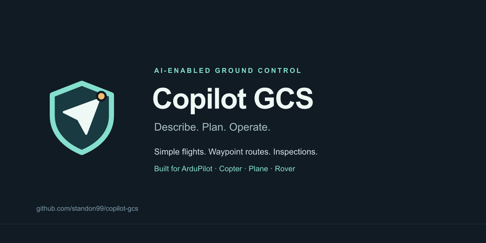

# Copilot GCS brand

The original icon combines a navigation arrow, protective shield and amber
waypoint, using the app's existing teal/dark palette. It is included under the
project's MIT license.


- [SVG source](../../web/public/icon.svg): app header and README.
- [512 px PNG](../../web/public/icon.png): general use.
- [32 px favicon](../../web/public/favicon.png) and
  [180 px touch icon](../../web/public/apple-touch-icon.png): browser shortcuts.
- [GitHub social preview](social-preview.png): 1280 × 640 PNG, under 1 MB.



GitHub provides a **Settings → General → Social preview → Edit → Upload an
image** setting for repository link previews. The committed `social-preview.png`
now uses the **Copilot GCS / AI-enabled ground control** identity. It was
uploaded to `standon99/copilot-gcs` on 2026-09-17 and the repository About text
was updated. GitHub published an image URL, but its image CDN returned HTTP 403
and the settings preview remained blank during verification; public rendering
of this replacement is not yet verified. The previous artwork had been visually
verified in the earlier publication recorded in `0984521`. To replace the image,
upload this export through the same setting using an account with repository
settings access. The icon also appears in the repository README. This does not change
the owner's profile avatar or GitHub's standard repository-type glyph.
[GitHub instructions](https://docs.github.com/en/repositories/managing-your-repositorys-settings-and-features/customizing-your-repository/customizing-your-repositorys-social-media-preview).

## Regenerate PNGs

The SVGs are editable source; PNGs are deterministic exports. From the repository
root with Node 22+ on PATH:

```sh
npm install --prefix .tools/brand-render --no-save @resvg/resvg-js
node docs/brand/render.cjs
```

Keep the mark in `social-preview.svg` aligned with `web/public/icon.svg` when
changing its geometry. The renderer is optional, ignored tooling; it adds no
runtime dependency to the app. Inspect exports and refresh affected screenshots
before committing a visible branding change.
