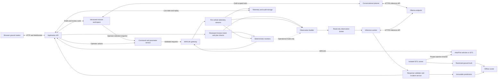

# Technical design: Copilot GCS

Current UI and AI/geofence behavior is documented in [product](product.md),
[implementation](implementation.md) and [AI interface](ai-interface.md).
This document remains the architecture/design baseline; references to future
dynamic model tools or the earlier four-step display are not current UI claims.


Design baseline v0.3 · 2026-09-17 · The product is an AI-enabled ground control station; see [product.md](product.md) for its task-first direction. See [implementation.md](implementation.md) for shipped behavior and remaining differences, and [validation.md](validation.md) for measured evidence. Targets below remain design targets unless verified there.

Build a browser application that provides the normal ground-station workflow and a persistent LLM copilot. The operator can describe a mission in chat or construct it on the map; both use one editable draft that the LLM can inspect and revise through conversation before upload. During operation, the backend continuously records and checks vehicle data, supplies bounded observations to an inference API, and presents evidence-linked assessments. An isolated Simulation diagnostics measures detection on faults whose identities are hidden from the monitor.

**Multiple vehicle types are required in the first release.** The initial profile set in this draft is multicopter Copter, conventional fixed-wing Plane, and ground Rover. Shared transport and UI infrastructure must not erase their differences in commands, flight/driving phases, units, failsafes, and safe recovery options.

See [feasibility.md](feasibility.md) for feasibility, alternatives, effort, and evidence limits; see [sitl-evaluation.md](sitl-evaluation.md) for the fault catalog and blind evaluation protocol.

## 1. Scope and product behavior

Copilot GCS helps operators turn everyday tasks into reviewed missions through an integrated AI planning workflow. The current release supports simulator control and external telemetry monitoring. Open one webpage to connect vehicles, inspect/change parameters, plan and execute supported missions, inspect logs, view satellite imagery, ask the LLM questions, and rehearse failure scenarios. The same backend interfaces should later support real MAVLink transports, but physical-vehicle readiness is a separate validation gate.

Support several connected sessions from the beginning, including a simultaneous Copter/Plane/Rover test. The selected vehicle is prominently shown beside every control and chat input. Background monitoring runs per vehicle even when its tab is not selected. Cross-vehicle chat is a separately labeled, read-only summary mode with explicit vehicle references.

| Workspace | Required first-release behavior |
| --- | --- |
| Live view | Vehicle selector; mode/armed state; link age; battery; GPS/EKF status; class-specific instruments; track, home, mission, and fence overlays; satellite/street basemap switch |
| Parameters | Search/group; descriptions, units, enums/bitmasks; current versus edited values; import/export; staged changes; validation; readback and audit history |
| Mission/control | One versioned draft shared by map/table editing and conversational planning; review, upload/download/verification, progress, supported modes, arm/disarm, and vehicle-specific movement/recovery controls |
| Mission intent | Optional plain-language brief; reviewable interpretation of objectives/constraints; comparison with staged/readback plans and live behavior; clause-linked deviations and unknowns |
| Logs | Live status messages, application events, command history, telemetry plots, recording, onboard log download when allowed, and synchronized replay |
| Copilot | Conversational plan creation/review/revision, change previews and upload card in the chat panel; automatic incident feed; evidence links; assessment age; uncertainty; monitor availability |
| Simulation diagnostics | Vehicle/model and scenario selection, start/stop, repeat with seeds, blind evaluation mode, and results revealed after predictions are locked |
| Connection/settings | Transport, detected firmware/profile, telemetry coverage, API endpoint/model/secret reference, imagery configuration, retention limits |

Use a persistent right-hand copilot panel, central map/instruments, a bottom timeline/log drawer, and separate parameter/mission workspaces. Alerts remain visible when chat or a large parameter table is open. A selected log/replay is conspicuously labeled historical and never becomes the live command target.

### Conversational mission planning

Support two equal entry paths into the same draft:

- **Describe the work:** the operator gives a task in chat, referring to a selected map region, known locations, or explicit coordinates. The planner uses the selected vehicle profile and available configuration to construct a draft. It asks about missing information that changes the plan's meaning, such as an unresolved location or altitude datum. Existing explicit preferences and approved profile defaults can be reused; every assumption remains visible.
- **Draw the mission:** the operator places/drags waypoints or imports a mission in the GCS, then asks the copilot to check it. No separate written mission statement is required. The planner checks the actual structured draft, available configuration, and any provided constraints. It can describe the apparent route, but must label inferred objectives as unconfirmed rather than inventing requirements.

All discussion and review findings appear in the LLM text-box area. Clicking a finding highlights the relevant waypoint, route segment, or field. An instruction such as “move that leg west of the exclusion area” authorizes a reversible edit to the local draft; the server validates the proposed change, updates the map/table, and returns a concise before/after card with undo. There is no separate approval prompt for each ordinary draft edit. A request only to review does not authorize silently changing the draft: the copilot explains findings and offers specific fixes.

Continue the same conversation to adjust altitude, speed, waypoint order, route geometry, or supported mission actions. Both manual and chat changes create revisions in one canonical mission model. Changes are scoped to the requested items; the copilot cannot quietly relax approved intent, remove an exclusion region, or modify unrelated parameters to make a plan pass. An explicit request to change intent creates a visible intent revision alongside the affected draft changes.

Review covers units/reference frames, supported mission items, route legs as well as waypoint positions, declared operating regions, altitude/speed constraints, command ordering, and profile-specific takeoff/return/landing requirements. Where performance data exists, check turn geometry and climb/descent feasibility; otherwise mark those checks unavailable. A line between clear waypoints is not proof of a clear route, and map imagery is not current obstacle sensing. Use deterministic geometry/unit/protocol checks to support numerical claims and the LLM to explain conflicts, ask useful questions, and propose alternatives.

After each settled edit, refresh inexpensive checks and invalidate prior reviews of the changed revision; debounce costly LLM reviews and provide an explicit “Check plan” action in chat. The planner reads the canonical structured plan and map selections through tools, so it need not infer coordinates from a screenshot or rely on a stale conversation summary. Concurrent manual edits cause stale model patches to be rejected and recomputed against the latest draft. Undo creates a new draft revision and never changes an already uploaded mission.

The final chat review card names the vehicle and exact draft revision, shows the route preview/change summary, and lists checked items, unresolved issues, assumptions, and unavailable evidence. It contains the explicit **Upload mission** action. This sends the reviewed immutable snapshot through the existing command/mission service and verifies the onboard readback. A draft edit cannot mutate an upload already in progress. If the draft, intent, vehicle, home/reference, or relevant configuration changes, refresh the review before upload.

Use clear states: `draft → checking → reviewed → uploading → uploaded and verified`. “Reviewed” means the declared checks have run, not a guarantee of safety. “Deploy” in this planning flow means uploading the mission; **Start mission** is a separate operator action and upload does not automatically arm or launch. Both actions can be presented in the same chat panel, preserving their distinct effects. No routine control depends on an LLM response arriving; manual planning and numerical validation remain available during inference outages.

On start, continuous monitoring references the verified uploaded mission and active reviewed intent. Further chat edits create a future draft; they do not rewrite the executing plan. Replacing an active mission requires a separate, profile-supported operator upload workflow. The first-release planner is limited to the mission commands supported by each Copter/Plane/Rover adapter; unrestricted autonomous route optimization is outside that scope.

The first release includes the above workflow for all three profiles. It does not claim every feature of Mission Planner: firmware flashing, all calibration wizards, every mission command, joystick flight control, arbitrary peripheral management, and additional airframes are later parity work. Maintain a visible capability matrix so “unsupported” is explicit. The parameter editor is available across the connected vehicle's discovered parameter set, subject to write policy.

## 2. Architecture and boundaries



Use separate capability contexts for the conversational planner and continuous monitor, even if they share a model/provider. The planner can read and edit only the authorized local draft through the mission workspace; the monitor can read broker observations and write assessments. Neither can invoke vehicle commands, upload a mission, or access the injector. An operator-originated upload selects a concrete snapshot through the API. These boundaries use separate credentials and process/network permissions, not just prompts.

Proposed stack: **TypeScript/React** frontend, **MapLibre GL JS** map, **Python/FastAPI** application API, and **pymavlink** using the `ardupilotmega` dialect. Use SQLite for session metadata, incidents, and command journals; append-only telemetry/event files plus an in-memory recent-history buffer for the prototype. Add columnar archives only if measured replay/storage needs justify them.

Keep the MAVLink gateway and inference worker in separate processes so a provider stall or parsing failure cannot block link reads, heartbeats, or command acknowledgements. Other services may initially be modules in the API process. Use bounded queues: preserve commands/alerts/audit events, coalesce display updates, and record any telemetry loss. A single dedicated reader owns each transport; do not let competing `recv_match` consumers steal each other's responses.

Deploy the webpage and API from one local origin, initially loopback-only. The existing Copter launcher supports a direct TCP connection at `127.0.0.1:5760`; MAVProxy forwarding is an alternative development topology. Each additional simulator needs its own runtime directory and allocated ports. Do not assume two clients can independently own the same SITL TCP stream. [SITL connection documentation](https://ardupilot.org/dev/docs/using-sitl-for-ardupilot-testing.html)

## 3. Vehicle profiles and session identity

Identify a session using a server-assigned connection ID, link instance, MAVLink system/component IDs, firmware identity, and a boot epoch. System ID alone is insufficient: independent SITL links commonly reuse it. Obtain vehicle type from heartbeat and firmware/capability information from `AUTOPILOT_VERSION`; reconcile with the configured profile. A mismatch or ambiguous identity blocks writes. Vehicles sharing one MAVLink network must have distinct system IDs; application namespacing cannot repair ambiguous on-wire addressing.

Each profile defines mode decoding, supported commands/mission items, parameter metadata revision, phase classification, telemetry requirements, rule thresholds, recovery guidance, and fault adapters. The profile is versioned and included in observations, audit events, and benchmark manifests. Unknown firmware remains inspectable with an explicit unverified status; validated command support requires a matching profile.

| Profile | Additional context and instruments | Initial action semantics |
| --- | --- | --- |
| Copter | Attitude, relative altitude, vertical speed, motor-output balance, hover/climb/landing phases | Supported modes; guided takeoff; land/RTL; mission execution; landed-state verification |
| Conventional Plane | Airspeed versus groundspeed, altitude datum, bank, climb/descent, mission approach/landing phases | Profile-supported guided changes and planned takeoff/landing missions; no Copter-style generic “land here” assumption |
| Rover | Speed, heading, steering/throttle output, stopped/moving phases, waypoint progress | Supported modes; guided destinations; mission execution; hold/return where supported; no takeoff/landing controls |

Different vehicles accept different guided commands; expose controls from the adapter, never from a generic mode-number table. Failsafe interpretation is also profile-specific. [Plane guided commands](https://ardupilot.org/dev/docs/plane-commands-in-guided-mode.html), [Rover guided commands](https://ardupilot.org/dev/docs/mavlink-rover-commands.html), [Plane failsafes](https://ardupilot.org/plane/docs/apms-failsafe-function.html), [Rover failsafes](https://ardupilot.org/rover/docs/rover-failsafes.html)

Namespace caches, pending acknowledgements, replay cursors, conversations, inference budgets, and parameter metadata by session. Switching vehicles clears any unsubmitted action form. Only one operator holds the write lease for a vehicle; other browser sessions are viewers. The gateway still accounts for external GCS changes because its lease cannot constrain software outside this application.

## 4. MAVLink integration and correctness

### Telemetry

Negotiate desired streams with `MAV_CMD_SET_MESSAGE_INTERVAL`, measure what arrives, and display missing or reduced coverage. If MAVProxy or another GCS shares the channel, designate one stream-rate owner to avoid conflicting requests. Parameter/mission transfers can reduce telemetry rates, so transfer load and staleness must be observable. [ArduPilot stream control](https://ardupilot.org/dev/docs/mavlink-requesting-data.html)

These are initial targets for local SITL, not guaranteed firmware rates or recommendations for a bandwidth-limited radio:

| Data | Example messages | Target rate |
| --- | --- | --- |
| Identity, armed state, mode | `HEARTBEAT`, `AUTOPILOT_VERSION` | Heartbeat about 1 Hz; version on connect |
| Position and movement | `GLOBAL_POSITION_INT`, `LOCAL_POSITION_NED`, `VFR_HUD` | 5–10 Hz |
| Attitude | `ATTITUDE` | 10 Hz |
| Battery and sensor health | `BATTERY_STATUS`, `SYS_STATUS` | 1–2 Hz |
| GPS and estimator health | `GPS_RAW_INT`, `GPS2_RAW`, `EKF_STATUS_REPORT` | 2–5 Hz where supported |
| Navigation demand and vehicle phase | `NAV_CONTROLLER_OUTPUT`, `ATTITUDE_TARGET`, `EXTENDED_SYS_STATE` | 1–5 Hz where supported |
| Vibration, pressure, inputs/outputs | `VIBRATION`, `SCALED_PRESSURE`, `RC_CHANNELS`, `SERVO_OUTPUT_RAW` | 2–5 Hz where relevant |
| Events, missions, fence state | `STATUSTEXT`, `MISSION_CURRENT`, `FENCE_STATUS` | Events/default rates |

Store original message fields and normalized values. Include source time, monotonic receive time, session/boot epoch, units, quality, and a stable evidence ID. Handle absent fields and MAVLink unknown-value sentinels as unknown, never as zero. Keep AMSL, relative-to-home, and terrain altitude distinct; convert NED signs, radians/degrees, scaled coordinates, voltage/current units explicitly. Output PWM is a commanded actuator signal, not a measured motor speed.

Preserve extrema, rates of change, sample counts, and gaps when reducing telemetry for the LLM. Averages alone can erase a short failure. Start a new epoch on reboot and prevent histories or pending actions from spanning it. Estimate packet loss per source/link, accounting for duplication/reordering; do not interpret every sequence gap as an aircraft fault.

### Parameters

Download with `PARAM_REQUEST_LIST`, track completeness, and request missing values. Cache by vehicle/boot/firmware and parameter name. Use downloaded values as the authority; version-matched metadata supplies descriptions and validation. Reconcile when enabling subsystems exposes more parameters. An unknown metadata version must not silently borrow current-master ranges. [ArduPilot parameter protocol](https://ardupilot.org/dev/docs/mavlink-get-set-params.html)

Operator writes follow `draft → validated → sent → observed → verified`, with distinct `rejected`, `conflict`, and `unknown` outcomes:

1. Stage a diff with parameter name, old/new value, type, units, reboot requirement, and affected vehicle. Normal edits are disarmed-only in the first release.
2. Re-read the current value and check the operator lease, session identity, metadata, and freshness. A changed old value requires refreshing the diff.
3. Serialize writes per vehicle/parameter; encode the firmware's expected type and preserve integer/bitmask semantics.
4. Send `PARAM_SET`; reconcile matching `PARAM_VALUE`, then issue a separate readback and check stability. A parameter write does **not** use `COMMAND_ACK`.
5. Record the final observed value and result. A returned echo alone is insufficient, including read-only parameters that may echo then revert. Reboot-required settings remain “stored; reboot pending” until separately checked after reboot.

The service adds optimistic conflict detection but MAVLink does not provide an atomic compare-and-swap against another GCS. Bulk edits are a sequence with a per-item journal, not a transaction. On interruption, report partial completion and refresh values. Restoration is a new reviewed write sequence; do not silently undo subsequent external changes.

### Commands and missions

Human controls, including action cards in chat, construct typed, profile-supported actions. Conversational draft editing does not grant vehicle-write authority. The backend rechecks identity, fresh state, control lease, capability, and preconditions immediately before sending. The first release excludes forced arming/disarming and arbitrary raw-command entry. Simulator setup and fault injection use a separate authorized path limited to owned SITL processes.

For commands, correlate `COMMAND_ACK` by source and command, serialize ambiguous outstanding operations, use bounded protocol retries, and track progress/timeouts. An accepted acknowledgement is followed by observed state verification; for example, check the armed bit or mode transition. A reconnect never resends an old operator request automatically. Application idempotency keys prevent duplicate HTTP submissions but do not promise exactly-once physical execution. Establish one controlling GCS in validation; competing indistinguishable commands can make acknowledgement ownership ambiguous and must produce an unknown/conflict result. [MAVLink command protocol](https://mavlink.io/en/services/command.html)

That acknowledgement flow applies to `MAV_CMD` transactions carried by `COMMAND_LONG`/`COMMAND_INT`. Messages such as `SET_MODE` and `SET_POSITION_TARGET_*` need adapter-specific state/response checks and must not wait for a nonexistent command acknowledgement. Any supported streaming setpoint action needs its own renewal/watchdog behavior; it cannot be implemented as a single reliable command. The initial mission/destination UI does not expose continuous joystick control.

For missions, implement the request/item/ack state machine with `MISSION_ITEM_INT`, explicit coordinate frames and altitude reference, and download/compare after upload. Keep mission, fence, and rally transfers separate and validate supported items per profile. Cancellation, packet loss, partial transfer, and unknown completion are visible states. [MAVLink mission protocol](https://mavlink.io/en/services/mission.html)

### GCS presence

The gateway owns the configured GCS heartbeat identity; the LLM worker never emits heartbeats or RC overrides. In this local application design the backend represents GCS presence, so closing a browser does not itself simulate loss of the vehicle link. The UI write lease expires on disconnect, while monitoring continues. Document this behavior and test browser loss, backend loss, and radio/link loss separately. A future physical deployment must select and validate an operator-presence policy explicitly.

GCS-loss scenarios must suppress every heartbeat from the configured controlling GCS, including any router/MAVProxy sender that could mask the loss. Expected behavior is derived from the active vehicle's failsafe configuration. Copter, for example, uses GCS heartbeat age with its configured timeout/action. [Copter GCS failsafe](https://ardupilot.org/copter/docs/gcs-failsafe.html)

## 5. Logs, replay, and imagery

Record three distinct streams: received MAVLink telemetry, onboard DataFlash logs, and application audit/LLM events. The live log window includes status messages and command outcomes; the postflight viewer aligns plots, track, parameter changes, and copilot assessments on a common timeline. Label missing coverage rather than implying that a ground-station recording contains everything the autopilot logged.

Implement completed onboard-log listing/download with the `LOG_*` protocol and disarmed checks. Resume missing byte ranges and verify coverage against reported size. Optional MAVFTP or onboard log streaming is separate, capability-tested work. The monitoring loop must not depend on downloading an onboard log during flight. [ArduPilot log download](https://ardupilot.org/dev/docs/mavlink-log-download.html)

A replay reads only up to its current cursor, feeds the same normalization path, and has no command capability. Live and retrospective LLM assessments have separate labels and metrics. Raw DataFlash files remain outside the blind monitor because they can contain simulator state, parameters, and future evidence.

Use MapLibre with a configured satellite raster provider and visible attribution. Keep route/vehicle overlays usable when tiles fail. Imagery is a basemap, not current obstacle sensing or proof that a landing area is clear. Offline caching is optional and depends on the provider's permitted use. [MapLibre raster sources](https://maplibre.org/maplibre-gl-js/docs/API/classes/RasterTileSource/)

## 6. Continuous monitoring and LLM access

### Independent monitoring paths

The autopilot retains its existing failsafes. A deterministic backend monitor handles data freshness, native health transitions, configured battery limits, mission/fence deviations, and profile-specific consistency checks. It emits alerts without waiting for inference. Its threshold registry includes units, vehicle applicability, operating phase, hysteresis, minimum duration, source, and version; no universal voltage or airspeed threshold is hardcoded across vehicles.

The LLM receives observations to explain changes, connect evidence across sensors, suggest checks, and surface additional hypotheses. It can disagree with a rule's interpretation, but cannot suppress or resolve that rule's alert. Absence of LLM findings means “no additional issue identified in the supplied data,” not “vehicle safe.”

Initial deterministic examples are heartbeat/stream staleness; battery threshold crossings with duration; degraded GPS/estimator flags; unexpected mode changes; cross-track error with phase-aware tolerances; Copter vibration and persistent attitude/output anomalies; Plane airspeed/groundspeed/altitude inconsistencies; and Rover commanded-versus-observed motion. Exact thresholds and observability are part of the per-profile spike.

### Mission intent and operator-error prevention

An optional mission statement defines what the operator intends to accomplish. Preserve it separately from the uploaded waypoint mission: a vehicle can follow its uploaded plan correctly while violating the operator's original objective. Compare three records throughout the session: **reviewed intent, actual loaded plan/configuration, and observed behavior**. An imported or changed mission never silently rewrites the intent to make itself compliant.

The LLM proposes a structured interpretation and identifies ambiguity, contradictions, and missing observability. The operator reviews the original clauses beside that interpretation before activating it. Use a restricted declarative constraint schema, not model-generated code. Each constraint records its source clause, vehicle/profile, quantity, units/reference frame, allowed range or objective, activation phase/region, persistence/tolerance, required evidence, and severity. Keep author, revision, effective time, mission-readback hash, and home/reference revision. Ambiguous clauses remain unresolved; unsupported clauses remain explicitly unmonitorable. With no statement provided, ordinary vehicle monitoring continues without invented mission requirements.

For example, the statement “maintain 50 m during the survey” leaves the vertical datum and tolerance unresolved. A reviewed interpretation might become “45–55 m above the recorded launch elevation during survey legs; warn after two seconds outside that band.” Those numbers are illustrative choices requiring review, not flight recommendations. A target altitude, a maximum ceiling, and a minimum clearance are different constraints. Relative-to-home, above-ground, and mean-sea-level altitude must not be interchanged. [ArduPilot altitude definitions](https://ardupilot.org/copter/docs/common-understanding-altitude.html)

If the intent instead specifies height above ground, the observation needs a suitable terrain/range estimate with compatible vertical datum, valid coverage, and known uncertainty. Satellite imagery alone is insufficient. If the necessary evidence becomes stale or unavailable, report **cannot evaluate**. If home moves, re-evaluate any dependent reference; an intent anchored to launch elevation must not silently follow a newly relocated home.

For the first release, support altitude bands for aerial profiles, speed limits with explicit airspeed/groundspeed semantics, geographic regions/corridors, required mission steps/order, and simple phase conditions. Rover uses speed/route/task constraints rather than aerial altitude controls. Each result is `satisfied`, `violated`, `not_applicable`, or `unknown`, with evidence and active intent revision. Preserve brief excursions even when an approved persistence rule suppresses an alert. Account for measurement uncertainty near a boundary instead of presenting a noisy estimate as exact compliance.

Use the interpretation at three points:

1. **Before an ordinary operator action:** compare a staged mission, parameter change, or command with the active intent and readback configuration. Surface specific conflicts in the existing review panel, such as a waypoint at 80 m against an approved 45–55 m survey band. Recheck if intent, mission, reference frame, or vehicle state changes before sending. A pending LLM review cannot stall urgent controls; numerical checks are deterministic.
2. **During execution:** compute measurable constraints continuously; give the LLM the approved clauses, permissible evidence, and plan/behavior changes to explain conflicts and combined risks. It may flag a semantic mismatch that the supported numerical grammar cannot express, but that remains an advisory finding. Takeoff, landing, transit, survey, and recovery conditions need explicit applicability rules. An unknown phase cannot silently disable a constraint.
3. **After execution:** report achieved objectives, deviations, exceptions, and gaps with time/evidence links. Waypoint completion alone does not prove payload work or survey coverage; those claims require relevant feedback/data.

Intent monitoring initially produces warnings and review findings. It does not upload a fence, change parameters, veto an autopilot failsafe, or execute an LLM correction. Onboard fence configuration remains a separate, vehicle-specific operator workflow. Some intent constraints can later be mapped to supported onboard protections, but only after an explicit reviewed configuration change and readback. [ArduPilot fence capabilities](https://ardupilot.org/copter/docs/common-geofencing-landing-page.html)

Objectives must retain their priority and exception context. For example, a mission-level minimum altitude must not cause the application to obstruct an emergency descent. Report the mission deviation and the observed failsafe/recovery context together; the LLM cannot invent an exception, silently relax a limit, or resolve an alert by editing the intent. Ordinary chat suggestions do not change the active intent revision.

Candidate uses beyond altitude monitoring are:

| Situation | Example proposed assistance | Required evidence/limit |
| --- | --- | --- |
| Plan-entry mistakes | Identify units/datum mistakes, an implausible waypoint, the wrong vehicle, or an omitted mission segment | Reviewed brief, profile, staged plan, and readback; numerical geometry/unit checks provide the facts |
| Configuration conflicts | Explain why a changed mode, return setting, or disabled capability conflicts with the intended operation | Firmware-specific parameter semantics and current settings; no universal return/landing recommendation |
| Wrong mode or stalled workflow | Flag that a survey has not started, the vehicle is holding unexpectedly, or progress has stopped | Expected phase/step, actual mode, command outcomes, and motion; pauses need explicit allowances |
| Deteriorating completion margin | Explain a shrinking estimated energy/time margin for the remaining mission or return | A separately validated consumption/route model with uncertainty; the LLM does not invent range or battery reserve |
| Payload/task omission | Notice missing camera-trigger feedback or a required sensor/recording step | Actual payload acknowledgements or data; absence of feedback may mean unknown completion |
| Combined weak symptoms | Connect small tracking errors, changed demand, and energy usage into a hypothesis for investigation | Time-aligned telemetry and operating context; plausible explanations are not confirmed causes |
| Recovery and handover | Summarize active issues, what changed, which constraints are affected, and evidence relevant to available recovery options | Current state and profile-specific procedures; all vehicle actions remain human-originated |
| Conflicting operations across vehicles | Later, flag overlapping operating regions/time windows or inconsistent assignments | Explicit shared intent, reliable clock/frame alignment and fresh positions; not an automatic collision-avoidance function |

The first-release constraint grammar and plan/behavior comparison are core scope. Calibrated energy prediction, payload-specific verification, and cross-vehicle coordination are separate extensions unless their required data/adapters are included. This avoids treating every brainstormed use case as already supported.

### Scheduling and context

Acquire continuously, update the browser at approximately 5–10 Hz, evaluate rules on relevant arrivals/timers, and request an LLM review every **5 seconds** per active vehicle. Operational mode may also request a review on a material change, coalesced with a two-second minimum gap. Fixed-cadence benchmark mode disables these extra triggers to avoid leaking anomaly timing.

Allow one monitor request in flight and one newest pending observation per vehicle. Never build a backlog of stale assessments. Use a global fair queue and reserve capacity for every active vehicle; chat cannot starve monitoring. Start with a 12-second request deadline and a 15-second maximum age from observation cutoff for a current assessment. A result beyond that age is retained as historical, excluded from current advice, and recorded as late. If this cannot keep up, show degraded coverage and reduce the number of admitted sessions or choose a faster model; never silently imply five-second reviews are being delivered.

Each observation contains a small current-state snapshot, a 10-second detailed trend, a 60-second summary, selected verified parameters/mission context, active reviewed mission intent when provided, and evidence IDs. Include the intent revision and its effective time; include computed compliance findings only in the operational observation view. Keep a rolling recent-history buffer, initially five minutes, for bounded follow-up queries. Phase inference is deterministic, versioned, and allowed to be unknown. It never uses the private scenario state.

Pin tool reads to the observation cutoff and boot epoch. Historical queries cannot read future samples, including when the request finishes after more telemetry arrives. Run the same generic observation builder on nominal and fault runs.

### Inference provider

Configure `protocol`, `base_url`, `model`, secret reference, timeout, input/output budgets, and capability flags. Initial target: an OpenAI-compatible chat-completions request to an Ollama endpoint. Ollama documents direct cloud access at `https://ollama.com/v1` and bearer-key authentication; a native `/api/chat` adapter can be added without changing the observation contract. No local model hosting is required. [Ollama compatibility](https://docs.ollama.com/api/openai-compatibility), [authentication](https://docs.ollama.com/api/authentication)

Probe the selected endpoint/model for streaming, tool calls, and schema support rather than assuming that compatibility implies parity. Ollama's cloud documentation currently excludes structured outputs. Request the agreed JSON shape in the prompt, validate it with an application schema, and permit at most one format-only repair within the original deadline. An invalid response becomes `assessment_unavailable`, never a green health state. Strict schema mode is an optimization only if the endpoint actually supports it. [Ollama structured outputs](https://docs.ollama.com/capabilities/structured-outputs)

For provider errors, use bounded retries/backoff and a circuit breaker; retain deterministic alerts, live controls, and recording. The UI shows last successful assessment, observation cutoff, pending/failed status, and coverage gaps. No failed request blocks the telemetry reader.

### Tool capabilities and trust

Optional model tools are `get_state`, `get_series`, `get_parameter`, `get_mission`, `get_mission_intent`, and `search_reference`. The broker enforces vehicle/session/cutoff and data-view policy, caps rows/time ranges, and permits at most two tool rounds per assessment. Parameters are drawn from a positive allowlist. Reference retrieval uses a pinned firmware-specific corpus, not arbitrary web browsing or the workspace filesystem. If the chosen model cannot call tools reliably, supply the same bounded context directly.

For user-authorized planning turns, expose an additional bounded workspace API: `get_draft`, `get_map_selection`, `check_draft`, and `apply_draft_patch`. Draft patches include workspace/vehicle identity, base revision, typed operations on stable item IDs, and a human-readable rationale. The server enforces schema, supported commands, coordinate/units validity, revision matching, edit scope, and idempotency. Use bounded numerical helpers for route calculations rather than trusting invented distances or coordinates. Preserve unsupported imported mission items explicitly; never silently drop or reinterpret them. The result is a new local revision with validation findings and reversible history, not MAVLink output. These tools are absent from continuous-monitor and blind-evaluation credentials. Invalid model JSON produces no edit.

No shell, arbitrary SQL, general filesystem, raw MAVLink endpoint, URL fetch, vehicle-write tool, or benchmark-runner access is exposed to either model context. Device text, log strings, retrieved documents, and chat content cannot change tool permissions or become new system instructions. Model text is rendered as text/limited Markdown, never executed. Treating it this way also protects against instructions arriving in `STATUSTEXT`.

Mission statements are task content, never tool authorization. Instructions embedded in them cannot enable writes, suppress logging, access simulator truth, or alter the observation policy. The model can propose an interpretation in its response; only the operator-facing service can activate a reviewed intent revision.

Continuous-monitor state and planning chat are separate behind one copilot panel. Chat can inspect authorized evidence and perform requested draft edits. Parameter/vehicle-action suggestions appear as structured review cards using the ordinary operator workflow, with current values and the concrete effect shown in the same panel; users need not copy text into another screen. Vehicle writes still originate from the operator action, not a model tool call. In a scored blind trial, planning is frozen before private scenario selection, operator chat never reaches the monitor, and neither model context can access the experiment's private data.

## 7. Observation and assessment contracts

Use versioned schemas shared by the broker, validator, frontend, recorder, and evaluator. The examples below are **synthetic contract examples, not measured telemetry**. The server supplies identity, time, model, and provenance fields; a model cannot override them.

```json
{
  "schema_version": "observation.v1",
  "observation_id": "obs-91",
  "vehicle_session_id": "vehicle-7",
  "boot_epoch": 2,
  "profile": "copter-multirotor.v1",
  "cutoff_monotonic_ms": 128000,
  "window_start_monotonic_ms": 118000,
  "data_view": "operational.v1",
  "fields": [
    {
      "name": "battery.pack_voltage",
      "value": 15.6,
      "unit": "V",
      "age_ms": 120,
      "quality": "valid",
      "evidence_id": "ev-41"
    },
    {
      "name": "gps.fix_type",
      "value": null,
      "unit": "enum",
      "age_ms": 3800,
      "quality": "stale",
      "evidence_id": "ev-42"
    }
  ],
  "trends": [],
  "verified_parameter_context": {},
  "mission_context": null,
  "mission_intent": null
}
```

An accepted model payload can be:

```json
{
  "schema_version": "assessment.v1",
  "observation_id": "obs-91",
  "assessment": "insufficient_data",
  "findings": [
    {
      "category": "data_gap",
      "severity": "warning",
      "observation": "The supplied GPS fix information is stale.",
      "hypothesis": null,
      "certainty": "supported_observation",
      "evidence_ids": ["ev-42"],
      "suggested_check": "Inspect GPS message freshness and link coverage."
    }
  ]
}
```

Validate enums, lengths, evidence references, vehicle/session ownership, cutoff, and finite numeric values. Reject fabricated evidence IDs. Categories cover navigation, energy, propulsion/motion, sensor consistency, control, configuration, data gap, and unknown; the output vocabulary must also allow an unexplained anomaly. Certainty describes observation versus hypothesis, not a calibrated probability.

Every incident card shows source (`autopilot`, `rule`, or `LLM`), first/last evidence time, current data age, severity, observation, possible causes, and suggested checks. Mission-deviation findings also reference the intent revision and clause/constraint ID, the required condition, and observed/loaded values. The backend assigns incident IDs and groups repeated findings by vehicle/subsystem/time overlap. Use escalation, acknowledgement, and recovery states; acknowledgement does not assert recovery. LLM-only incidents require fresh evidence on later observations before being marked recovered, and become stale when coverage is lost.

A statement such as “motor 2 failed” requires discriminating evidence beyond output imbalance. A suitable less-specific result is “persistent output asymmetry with attitude error; propulsion loss is one possible cause.” Numerical and citation validation can catch malformed or unsupported references, but does not prove that a model's causal inference is correct. Human review remains part of evaluation.

## 8. Application API and storage

These are proposed application endpoints, not existing ArduPilot APIs:

| Endpoint | Purpose and boundary |
| --- | --- |
| `POST /api/v1/connections` | Open an allowlisted transport and discover sessions/capabilities |
| `GET /api/v1/vehicles/{id}/state` | Versioned snapshot with ages and coverage |
| `WS /api/v1/events` | Authorized live state, incidents, command progress, and chat chunks; each event includes session and sequence |
| `GET /api/v1/vehicles/{id}/parameters` | Filtered operator parameter table with completeness/metadata state |
| `POST /api/v1/vehicles/{id}/parameter-changes` | Create a concrete staged diff with expected old values |
| `POST /api/v1/parameter-changes/{id}/apply` | Human-authorized apply, expiry, idempotency, fresh-state recheck |
| `POST /api/v1/vehicles/{id}/actions` | Typed vehicle-specific action with lease and preconditions |
| `PUT /api/v1/vehicles/{id}/mission-draft` | Map/table edits to the canonical draft with expected revision; upload is separate |
| `POST /api/v1/vehicles/{id}/mission-draft/patches` | Validated conversational edits to a particular base revision; no vehicle writes |
| `POST /api/v1/vehicles/{id}/mission-draft/reviews` | Check an immutable draft/context revision and return chat findings/coverage |
| `POST /api/v1/vehicles/{id}/mission-uploads` | Operator uploads the exact selected draft/review revision; progress and readback status |
| `POST /api/v1/vehicles/{id}/intent-drafts` | Store an optional brief and proposed structured interpretation with unresolved clauses |
| `POST /api/v1/intent-drafts/{id}/activate` | Operator reviews and activates an immutable revision; does not change the vehicle mission or parameters |
| `GET /api/v1/vehicles/{id}/logs` | List recordings/onboard logs; separate download job status |
| `POST /api/v1/chat` | Human chat scoped to named live sessions or a historical recording |
| `POST /lab/v1/runs` | Separate simulation diagnostics service; absent from the monitor credential's route set |
| `GET /lab/v1/runs/{id}/report` | Results access after the prediction record is closed |

Every vehicle-write request includes session identity, boot epoch, control-lease token, expiry, and idempotency key. Local draft edits use workspace authorization, selected vehicle/profile, base revision, and idempotency, and may be made while disconnected; offline review must label unavailable live checks. Return a job ID and its lifecycle for vehicle operations rather than claiming success when bytes are sent. WebSocket reconnects supply a resume sequence or receive a fresh snapshot; lost event history is explicit.

Store vehicle sessions/profiles, parameter snapshots and metadata provenance, mission draft revisions/patch authorship, review coverage/context hashes, immutable upload snapshots/readbacks, original mission briefs, reviewed intent revisions/constraint results, command journals, incidents, observations, API requests/responses, tool results, and replay indices. Track schema/model/prompt versions and hashes. Keep raw secrets out of requests captured for audit. Preserve the exact model-visible payload for reproducibility, including failed or repaired outputs.

Use size/time rotation and a configured storage quota with visible remaining capacity. Recording failure creates an application alert and disables claims of complete capture; controls and live monitoring continue. Evidence referenced by a retained incident must be retained with it or marked unavailable. Benchmark artifacts are immutable for a completed report and are not removed by ordinary rolling retention.

## 9. Isolation, security, and degraded behavior

Keep the API key in an environment-backed or OS-backed secret store on the backend, never in browser JavaScript, local storage, prompts, exports, or source control. An API key is a setup input for implementation, not needed to review this design. Restrict configurable inference destinations to approved origins so a redirected endpoint cannot receive credentials unexpectedly.

Validate HTTP/WebSocket origin and local session tokens even on loopback; require authenticated TLS for LAN/remote access. Separate viewer, operator, and lab privileges. Before connecting physical vehicles, use authenticated transport where available and protect network paths. MAVLink 2 signing authenticates message origin; it does not encrypt telemetry. [MAVLink signing](https://mavlink.io/en/guide/message_signing.html)

| Failure | Required behavior |
| --- | --- |
| Inference timeout, malformed JSON, rate limit, or unavailable provider | Show monitoring degradation and last assessed cutoff; preserve rules, controls, and recording |
| Browser closes/freezes | Revoke its write lease; backend monitoring continues; apply the documented GCS-presence policy |
| Vehicle telemetry stops | Deterministic stale-link alert; grey/age frozen values; block ordinary writes; do not invent current vehicle state |
| Telemetry resumes or vehicle reboots | Re-identify, refresh state/parameters as needed, establish a new epoch, and expire outstanding actions |
| Packet/acknowledgement loss | Bounded retries/reconciliation; report unknown outcome if it cannot be verified |
| LLM returns advice for another vehicle | Reject by session/evidence validation; record a monitor error |
| Storage fills | Alert and record capture gaps where possible; preserve live operation |
| Imagery provider fails | Preserve overlays and telemetry; show missing basemap |
| Injector or lab process fails | End that trial as invalid; stop only owned SITL processes; never affect a physical connection |

Conversational instructions can authorize reversible local draft edits. No model tool can disable a vehicle failsafe, rewrite onboard thresholds, alter the uploaded/executing mission, or change mode; those effects require an operator action through the normal control path. Deterministic application warnings are informative; the actual flight/driving safety behavior remains in the autopilot and operator procedures.

## 10. Implementation sequence and acceptance

Implement vertically across all three profiles; do not finish a Copter-only application and retrofit identity later. Suggested repository layout keeps application work outside the upstream checkout:

```text
web/                       browser UI and generated API types
backend/gateway/           transport, telemetry, protocol state machines
backend/profiles/          copter, plane, rover semantics and capability tables
backend/monitoring/        rules, windows, observation schemas
backend/intent/            reviewed mission constraints and plan/behavior checks
backend/planning/          shared mission drafts, typed patches, reviews, snapshots
backend/copilot/           provider adapters, broker client, output validation
backend/storage/           recording, metadata, replay
lab/                       runner, versioned scenarios, restricted ground truth
eval/                      locked scoring rules, comparison reports
tests/                     protocol, isolation, replay, and SITL integration tests
docs/                      this design and experiment protocol
runtime/                   owned runtime artifacts, excluded from source control
ardupilot/                 existing upstream source/build checkout
```

1. **Profile/connectivity spike.** Build/run Plane and Rover alongside the existing Copter setup. Verify identity, streams, units, metadata, parameter read/write/readback while disarmed, a supported mission round trip, and basic log capture for each. Pin firmware, dialect, simulator model, and metadata hashes. Sample the actual Ollama endpoint/model's latency and format behavior.
2. **Complete the ordinary GCS path.** Deliver vehicle selection, instruments, map, parameter workflow, supported commands/missions, plots, recording/replay, and independent alert rules. Prove it remains responsive with the inference worker stopped.
3. **Add continuous assessments, mission intent, and chat.** Implement the broker and versioned contracts, a bounded intent grammar, both conversational/map planning entry paths, synchronized draft editing, plan/behavior comparison, and upload cards. Add evidence-linked incident cards, bounded tools, concurrency/fairness, request logging, and degraded UI states.
4. **Implement simulation diagnostics and the blind protocol.** Validate fault effects first, then evaluate matched nominal/fault runs, baseline detectors, leakage probes, held-out seeds, and intent/operator-error scenarios. Score brief interpretation separately from downstream deviation detection. Report results separately per vehicle and scenario.
5. **Review expansion.** Add missing GCS parity features and additional vehicle profiles using the same contracts. A physical-vehicle pilot requires bench/HIL checks, transport/heartbeat review, and domain review; SITL results alone do not establish real-world reliability.

Meaningful tests include lost/delayed/duplicate acknowledgements; read-only/clamped/reboot-required parameter cases; partial parameter downloads; reboot and reconnect; mission interruption; incorrect units/sentinels; map and provider failure; prompt injection; ground-truth access attempts; future-data access during replay; and a simultaneous three-vehicle run with overlapping system IDs on separate links. For planning, test manual edits racing model patches, undo, unsupported mission items, malformed patches, stale reviews, exact upload snapshots, and draft edits during active execution. Verify that commands, drafts, parameter writes, alerts, and chat never cross session boundaries, and neither model context can issue vehicle writes.

Initial performance targets are **p95 receipt-to-display under 250 ms** on the local machine and **p95 rule-condition-to-alert under 1 second**, excluding intentionally configured persistence and telemetry acquisition delays. LLM validity, timeliness, false alarms, and detection targets are in the [evaluation plan](sitl-evaluation.md#metrics-and-release-gates). These are proposed acceptance targets, not observed performance or a safety certification.

Open implementation choices are the exact three simulator frames and firmware pins, operator mission-command subset, imagery provider, account/model limits, storage quota, and threshold-review owner. The approved requirement is multiple types from the start; the selected Copter/Plane/Rover profile set is the draft's explicit scope assumption.
